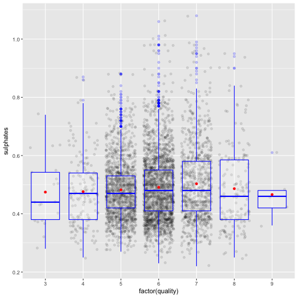

# 白葡萄酒质量数据


## 单一变量数据部分


```
## [1] 4898
```

```
## 'data.frame':	4898 obs. of  13 variables:
##  $ X                   : int  1 2 3 4 5 6 7 8 9 10 ...
##  $ fixed.acidity       : num  7 6.3 8.1 7.2 7.2 8.1 6.2 7 6.3 8.1 ...
##  $ volatile.acidity    : num  0.27 0.3 0.28 0.23 0.23 0.28 0.32 0.27 0.3 0.22 ...
##  $ citric.acid         : num  0.36 0.34 0.4 0.32 0.32 0.4 0.16 0.36 0.34 0.43 ...
##  $ residual.sugar      : num  20.7 1.6 6.9 8.5 8.5 6.9 7 20.7 1.6 1.5 ...
##  $ chlorides           : num  0.045 0.049 0.05 0.058 0.058 0.05 0.045 0.045 0.049 0.044 ...
##  $ free.sulfur.dioxide : num  45 14 30 47 47 30 30 45 14 28 ...
##  $ total.sulfur.dioxide: num  170 132 97 186 186 97 136 170 132 129 ...
##  $ density             : num  1.001 0.994 0.995 0.996 0.996 ...
##  $ pH                  : num  3 3.3 3.26 3.19 3.19 3.26 3.18 3 3.3 3.22 ...
##  $ sulphates           : num  0.45 0.49 0.44 0.4 0.4 0.44 0.47 0.45 0.49 0.45 ...
##  $ alcohol             : num  8.8 9.5 10.1 9.9 9.9 10.1 9.6 8.8 9.5 11 ...
##  $ quality             : int  6 6 6 6 6 6 6 6 6 6 ...
```

```
##   X fixed.acidity volatile.acidity citric.acid residual.sugar chlorides
## 1 1           7.0             0.27        0.36           20.7     0.045
## 2 2           6.3             0.30        0.34            1.6     0.049
## 3 3           8.1             0.28        0.40            6.9     0.050
## 4 4           7.2             0.23        0.32            8.5     0.058
## 5 5           7.2             0.23        0.32            8.5     0.058
## 6 6           8.1             0.28        0.40            6.9     0.050
##   free.sulfur.dioxide total.sulfur.dioxide density   pH sulphates alcohol
## 1                  45                  170  1.0010 3.00      0.45     8.8
## 2                  14                  132  0.9940 3.30      0.49     9.5
## 3                  30                   97  0.9951 3.26      0.44    10.1
## 4                  47                  186  0.9956 3.19      0.40     9.9
## 5                  47                  186  0.9956 3.19      0.40     9.9
## 6                  30                   97  0.9951 3.26      0.44    10.1
##   quality
## 1       6
## 2       6
## 3       6
## 4       6
## 5       6
## 6       6
```

数据总共有12个变量(忽略X)，4898条记录


```
##    Min. 1st Qu.  Median    Mean 3rd Qu.    Max. 
##   3.000   5.000   6.000   5.878   6.000   9.000
```

quality为5-6的品种占了绝大多数，6最多,其次是5和7。没有小于2的也没有10。


非挥发性酸长尾存在个别异常值，整体成正态分布，大多数据集中在5到8g/L。


挥发性酸整体存在长尾，小于0.5g/L的数据部分呈正态分布。


```
## [1] 19
```

柠檬酸含量长尾处有异常值，小于1g/L的数据呈正态分布。有19种没有检测出柠檬酸含量，在0.45-0.5之间以及0.7-0.75之间有异常高的值。


含糖量不成正态分布，进行变换


```
##    Min. 1st Qu.  Median    Mean 3rd Qu.    Max. 
##   0.600   1.700   5.200   6.391   9.900  65.800
```


log10(residual.sugar) 可以看出含糖量在1-2 g/L的品种最多，其次是2-18g/L，而大于45g/L（甜葡萄酒）非常少仅一种(也可能是异常值)。


含盐量长尾有大量异常值，小于0.1的部分呈正态分布


游离二氧化硫长尾少数异常值， 100以内呈正态分布


对总二氧化硫含量进行变换


sqrt变换后基本呈正太分布


density 密度长尾有少量异常值，大概呈正态分布


ph值呈正态分布，整体为酸性


```
##    Min. 1st Qu.  Median    Mean 3rd Qu.    Max. 
##   2.720   3.090   3.180   3.188   3.280   3.820
```


硫酸盐含量整体呈正态分布


变换之后整体大概呈正态分布，但不是很理想


```
##    Min. 1st Qu.  Median    Mean 3rd Qu.    Max. 
##    8.00    9.50   10.40   10.51   11.40   14.20
```

平均值略低于中位数，酒精度偏低的相对稍多一些

## 单变量分析
### What is the structure of your dataset?
1. 数据包含**12**个变量 **4898**条数据,变量如下

        fixed.acidity (非挥发性酸)
        volatile.acidity（挥发性酸）
        citric.acid（柠檬酸）
        residual.sugar（残余糖分）
        chlorides（氯化物，含盐量）
        free.sulfur.dioxide（游离二氧化硫）
        total.sulfur.dioxide (总二氧化硫)
        density（密度）
        pH
        sulphates(硫酸盐)
        alcohol（酒精度）
        quality (评分)

2. quality数据分值越高酒的质量越高。
分析结果

    - quality最小值为3，最大值为9平均值5.878，中位数为6，整体评分较好
    - 有19种没有检测到柠檬酸含量,不排除异常值
    - 最大pH值为3.820，所有葡萄酒都为酸性
    - 大约75%的葡萄酒含糖量低于9.9g/L,仅一种为甜葡萄酒(>45g/L)

### What is/are the main feature(s) of interest in your dataset?
quality 质量评级
### What other features in the dataset do you think will help support your investigation into your feature(s) of interest?
猜测会影响葡萄酒质量的指标有volatile.acidity（挥发性酸含量）, citric.acid（柠檬酸含量）,total.sulfur.dioxide(总二氧化硫含量)，residual.sugar（残余糖分）
### Did you create any new variables from existing variables in the dataset?
对residual.sugar（残余糖分）进行log10变化，total.sulfur.dioxide进行sqrt变换，对酒精度进行自定义变换(减去8再取平方根),使其呈正态分布

## 两变量部分
先整体看下变量之间的关系

```
##                                 X fixed.acidity volatile.acidity
## X                     1.000000000   -0.25581431      0.002857966
## fixed.acidity        -0.255814305    1.00000000     -0.022697290
## volatile.acidity      0.002857966   -0.02269729      1.000000000
## citric.acid          -0.149899918    0.28918070     -0.149471811
## residual.sugar        0.006623775    0.08902070      0.064286060
## chlorides            -0.045645192    0.02308564      0.070511571
## free.sulfur.dioxide  -0.011928911   -0.04939586     -0.097011939
## total.sulfur.dioxide -0.161979037    0.09106976      0.089260504
## density              -0.185976097    0.26533101      0.027113845
## pH                   -0.115774132   -0.42585829     -0.031915368
## sulphates             0.009807759   -0.01714299     -0.035728147
## alcohol               0.213656245   -0.12088112      0.067717943
## quality               0.035763247   -0.11366283     -0.194722969
##                       citric.acid residual.sugar   chlorides
## X                    -0.149899918    0.006623775 -0.04564519
## fixed.acidity         0.289180698    0.089020701  0.02308564
## volatile.acidity     -0.149471811    0.064286060  0.07051157
## citric.acid           1.000000000    0.094211624  0.11436445
## residual.sugar        0.094211624    1.000000000  0.08868454
## chlorides             0.114364448    0.088684536  1.00000000
## free.sulfur.dioxide   0.094077221    0.299098354  0.10139235
## total.sulfur.dioxide  0.121130798    0.401439311  0.19891030
## density               0.149502571    0.838966455  0.25721132
## pH                   -0.163748211   -0.194133454 -0.09043946
## sulphates             0.062330940   -0.026664366  0.01676288
## alcohol              -0.075728730   -0.450631222 -0.36018871
## quality              -0.009209091   -0.097576829 -0.20993441
##                      free.sulfur.dioxide total.sulfur.dioxide     density
## X                          -0.0119289106         -0.161979037 -0.18597610
## fixed.acidity              -0.0493958591          0.091069756  0.26533101
## volatile.acidity           -0.0970119393          0.089260504  0.02711385
## citric.acid                 0.0940772210          0.121130798  0.14950257
## residual.sugar              0.2990983537          0.401439311  0.83896645
## chlorides                   0.1013923521          0.198910300  0.25721132
## free.sulfur.dioxide         1.0000000000          0.615500965  0.29421041
## total.sulfur.dioxide        0.6155009650          1.000000000  0.52988132
## density                     0.2942104109          0.529881324  1.00000000
## pH                         -0.0006177961          0.002320972 -0.09359149
## sulphates                   0.0592172458          0.134562367  0.07449315
## alcohol                    -0.2501039415         -0.448892102 -0.78013762
## quality                     0.0081580671         -0.174737218 -0.30712331
##                                 pH    sulphates     alcohol      quality
## X                    -0.1157741316  0.009807759  0.21365624  0.035763247
## fixed.acidity        -0.4258582910 -0.017142985 -0.12088112 -0.113662831
## volatile.acidity     -0.0319153683 -0.035728147  0.06771794 -0.194722969
## citric.acid          -0.1637482114  0.062330940 -0.07572873 -0.009209091
## residual.sugar       -0.1941334540 -0.026664366 -0.45063122 -0.097576829
## chlorides            -0.0904394560  0.016762884 -0.36018871 -0.209934411
## free.sulfur.dioxide  -0.0006177961  0.059217246 -0.25010394  0.008158067
## total.sulfur.dioxide  0.0023209718  0.134562367 -0.44889210 -0.174737218
## density              -0.0935914935  0.074493149 -0.78013762 -0.307123313
## pH                    1.0000000000  0.155951497  0.12143210  0.099427246
## sulphates             0.1559514973  1.000000000 -0.01743277  0.053677877
## alcohol               0.1214320987 -0.017432772  1.00000000  0.435574715
## quality               0.0994272457  0.053677877  0.43557472  1.000000000
```


可以知道和quality正相关的变量依次是
    
    alcohol（酒精度）,pH，sulphates(硫酸盐)
负相关的变量有
    
    density（密度）
    chlorides（氯化物，含盐量）
    volatile.acidity（挥发性酸）
    total.sulfur.dioxide (总二氧化硫)
    fixed.acidity (非挥发性酸)

其中属于化学成分的有
    
    chlorides(-0.21)
    volatile.acidity(-0.19)
    total.sulfur.dioxide(-0.17)
    fixed.acidity(-0.11)
    residual.sugar(-0.10)
    sulphates(0.05)
    citric.acid(-0.01)


如上图通过中位数可以看出整体上quality和alcohol是正相关的。
当quality值为5时，箱线图顶部出现大量异常值，这些异常值会导致alcohol的中位数比正常时低。
当quality为5的时候alcohol的中值和平均值都低于quality=3或者4，猜测quality=3或者4的葡萄酒可能是受其他特征影响。


当quality大于5时，density中位数和quality呈负相关，小于5时相关性不明显，猜测quality=3或者4的葡萄酒可能是受其他特征影响。
当quality为7时顶部有大量异常值出现。


当quality比较高时，chlorides相对低一些，当quality为5或者6时出现大量异常值，顶部异常值更多一些。


单看两变量，无法判断出volatile.acidity对quality的影响，当quality为5或6时顶部有大量异常值。


单看两变量，无法判断出total.sulfur.dioxide对quality的影响。当quality为5、6、7时，两端有少量异常值。


quality较高时fixed.acidity含量也较高，无法判断出fixed.acidity对quality的影响。当quality为5、6、7时两端都有异常值，当quality为4时顶部有少量异常值。


无法判断出residual.sugar对quality的影响，当quality为7时顶部有少量异常值。


无法判断出citric.acid对quality的影响，当quality为6、7、8时两端均有异常值，当quality为5时，顶部出现异常值。


quality较高时 ph值也较高。当quality为5、6时两端有异常值。




无法看出sulphates对quality的影响，当quality为5、6、7时顶部都有不少异常值。

以下是非quality字段的分析


density和alcohol呈负相关性


在不同的residual.sugar下图的趋势不同，将图分为两部分继续分析


当residual.sugar小于3g/L时 alcohol和residual.sugar呈正相关；大于3g/L时，呈负相关


density和residual.sugar呈明显的正相关。


ph值和fixed.acidity呈明显负相关。

## 两变量分析
### Talk about some of the relationships you observed in this part of the investigation. How did the feature(s) of interest vary with other features in the dataset?
当quality大于5时 quality和alcohol、ph值呈明显正相关，和density、chlorides、total.sulfur.dioxide、residual.sugar呈负相关；当quality小于5时，quality和alcohol、ph值呈负相关，和chlorides、fixed.acidity负相关，还需要综和分析。
### Did you observe any interesting relationships between the other features (not the main feature(s) of interest)?
density 和 residual.sugar强正相关，系数达到了0.839。density和alcohol强负相关 系数为0.78。pH值和fixed.acidity呈负相关。
### What was the strongest relationship you found?
density 和 residual.sugar强正相关，系数达到了0.839。

## 多个变量部分
和quality相关性最大的两个变量分别是alcohol(正相关)和density(负相关)，并且这两个变量也呈强负相关


从上图中可以看到density和alcohol呈负相关，整天上来看越往右下角quality越大，表示density越小alcohol越大，quality越大。

相关图中发现，residual.sugar和density呈强正相关，和alcohol呈强负相关，但和quality呈弱负相关


 
 
 从图中曲线发现当alcohol大于11时趋势变的平缓
 
 当alcohol大于11时：
 

```
##                residual.sugar    alcohol    quality
## residual.sugar     1.00000000 0.01904454 0.05964782
## alcohol            0.01904454 1.00000000 0.25790956
## quality            0.05964782 0.25790956 1.00000000
```

 当alcohol小于等于11时：
 

```
##                residual.sugar    alcohol    quality
## residual.sugar     1.00000000 -0.4442907 0.02802078
## alcohol           -0.44429072  1.0000000 0.21195518
## quality            0.02802078  0.2119552 1.00000000
```


观察相关图中发现，free.sulfur.dioxide和density呈强正相关，和alcohol呈强负相关，但和quality几乎不相关。


从上图可以大概可以看出当alcohol大于11时从上到下quality在降低，小于11时不明显，

当alcohol大于11时：


```
##                     free.sulfur.dioxide   quality
## free.sulfur.dioxide           1.0000000 0.2294052
## quality                       0.2294052 1.0000000
```

当alcohol大于9且小于等于11：


```
##                     free.sulfur.dioxide    quality
## free.sulfur.dioxide          1.00000000 0.06110865
## quality                      0.06110865 1.00000000
```

当alcohol小于9：


```
##                     free.sulfur.dioxide    quality
## free.sulfur.dioxide           1.0000000 -0.1047761
## quality                      -0.1047761  1.0000000
```


在alcohol大于11时，free.sulfur.dioxide和quality的相关系数是0.23；当alcohol小于等于11时，相关系数为0.06;当alcohol小于9时，呈负相关相关系数是-0.10。


观察相关图发现，volatile.acidity 和其他变量都没有较强的相关性，结合alcohol一块看一下


可以看出当quality为5时，volatile.acidity和alcohol呈负相关，其他时候都是正相关，另外发现 alcohol小于11时 volatile.acidity越小，quality越高

当alcohol小于等于11时：


```
##                  volatile.acidity   quality
## volatile.acidity         1.000000 -0.368509
## quality                 -0.368509  1.000000
```

当alcohol大于11时：


```
##                  volatile.acidity    quality
## volatile.acidity       1.00000000 0.00807827
## quality                0.00807827 1.00000000
```

经计算得知，当alcohol小于11时， volatile.acidity和quality的相关系数是-0.36；当alcohol大于11时 volatile.acidity和quality的相关系数是0.008


chlorides和alcohol呈负相关，整体上和quality呈负相关


total.sulfur.dioxide和alcohol呈负相关


该图可以看出free.sulfur.dioxide和total.sulfur.dioxide呈正相关


可知quality和free.sulfur.dioxide/total.sulfur.dioxide 是正相关的


sulphates和alcohol相关性不是很大,和quality的关系也不明显


## 多变量分析

### Talk about some of the relationships you observed in this part of the investigation. Were there features that strengthened each other in terms of looking at your feature(s) of interest?

整体上，当alcohol越大且density越小则quality越大。alcohol和density呈负相关。
    
    - 在alcohol大于11时，free.sulfur.dioxide和quality的相关系数是0.23；当alcohol小于等于11时，相关系数为0.06;当alcohol小于9时，呈负相关相关系数是-0.10。
    
    - 当alcohol小于11时，volatile.acidity和quality的相关系数是-0.36；当alcohol大于11时 volatile.acidity和quality的相关系数是0.008

    - 在alcohol大于11时residual.sugar和alcohol的相关系数是-0.02；当alcohol小于等于11时 residual.sugar和alcohol的相关系数是-0.44

### Were there any interesting or surprising interactions between features? 

quality不但和某种元素的含量有关系，和多种元素含量的对比也有关系，比如quality和free.sulfur.dioxide/total.sulfur.dioxide 呈正相关


### Did you create any models with your dataset? Discuss the strengths and limitations of your model. 
没有创建预测模型

## 最终的图形

### 图1

###  描述1
通过相关系数图知道和quality相关性最大的属性是alcohol，quality不是连续分布，所以选择箱线图来分析。
如图可见当quality大于等于**5**时，alcohol和quality呈**明显正相关**。在没有异常值的时候中值和均值相差不多，当quality值为5时，箱线图顶部出现大量异常值且中值比平均值小不少，所以是这些异常值导致alcohol的中位数比正常时低。

### 图2


### 描述2
如图，点的分布趋势从左上角到右下角，说明density和alcohol呈负相关，即随着alcohol增大density变小。从颜色上看整体趋势从左上角到右下角，颜色逐渐由褐色变成白色和绿色，说明随着alcohol的增大和density的减小，quality越来越好。

### 图3 


### 描述3
如上图，quality白色到绿色大多数分布在整个图的右边及下边，当alcohol小于11时，可以看出由上到下颜色趋势是从褐色到白色。说明当alcohol不同时，volatile.acidity对quality的**影响程度是不一样**的。为了更直观的发现差异，对alcohol以11为界，分别做volatile.acidity和quality的箱线图。
结合箱线图，可以看出当**alcohol小于11**时volatile.acidity和quality**呈负相关**；当**alcohol大于11**时，volatile.acidity和quality**几乎不相关**。

## 最终总结

通过以上分析得出：
    
- 对葡萄酒质量影响最大的因素是**alcohol(呈正相关)**和**density(呈负相关)**；在alcohol大于11的时候，free.sulfur.dioxide和质量呈正相关(系数0.23)，当alcohol小于11时，volatile.acidity和quality呈负相关(相关系数-0.36)。

- 原因应该是alcohol会影响葡萄酒的口感，free.sulfur.dioxide(游离二氧化硫)会影响葡萄酒的气味，volatile.acidity(挥发性酸)会影响到葡萄酒的口味。

- 由于相关系数都很低(低于0.5)且是在一定前提条件下，所以用alcohol、free.sulfur.dioxide和volatile.acidity推测quality不是很合适，猜测存在一些组合变量会直接影响葡萄酒的质量。

通过本次项目的学习，对于单个变量的直方图，箱线图，两个变量的散点图的作图能力有了很大提高。并且能够通过图形，发现数据的一些趋势，以及数据的异常点。同时通过对坐标轴进行变换，能够更容易看出数据存在的趋势和问题。

通过之前的分析，有两个问题：一是alcohol，volatile.acidity，free.sulfur.dioxide都会影响红葡萄酒的质量，但是他们与quality的相关系数都比较低，还不到0.5，不是很适合以此建立模型。二是考虑到上述情况，再联想到diamonds数据集的价格预测中价格与克拉的立方根存在很强的相关系数，猜想红葡萄酒的quality会不会也与某个特征的某种变换，或是多个特征的组合存在更号的相关性？这些可以作为后续的进一步尝试。


